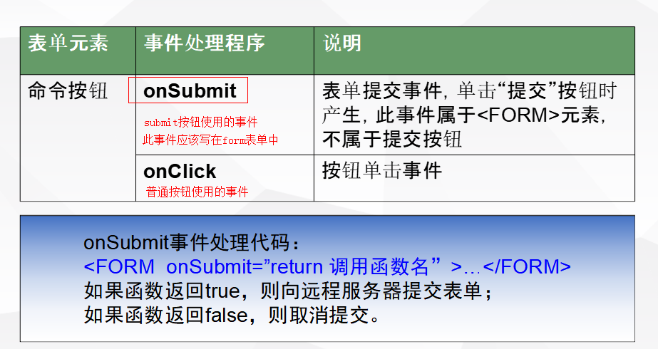

## 1.1 JavaScript概述

### 1.1.1 课程目标

1、掌握JS引入方式、基础语法、函数和对象

2、掌握JS数组、常用方法、对象和事件

3、掌握DOM对象、BOM对象、json基础

4、了解JS调试、表单验证、正则表达式、JSON简介和转换

### 1.1.2 FAQ手册

### 1.1.3 作业实践

1、下列关于JavaScript说法不正确的是（）

A、JavaScript是弱类型的语言 

B、 JavaScript常用的类型包括：int、string、boolean

C、 JavaScript常用的类型没有int型

D、 null是属于JavaScript中的类型

2、在文档对象模型(DOM)中，所有对象都继承自（）

A、document对象

B、math对象

C、history对象

D、frame对象

### 1.1.6 面试宝典

**一、JavaScript常见的应用场景？**

1）动态操作页面元素
2）处理页面元素触发的事件
3）检测或者控制浏览器行为
4）表单验证
5）异步交互（ajax)
6）前端页面框架开发等

**二、常用的js库有哪些？**

jQuery、vue、node等。

### 1.1.7 拓展资料

https://www.w3school.com.cn/

https://www.runoob.com/jquery/jquery-tutorial.html

## 1.2 JavaScript基础

### 1.2.1 课程目标

1、掌握JS引入方式

2、掌握JavaScript基础知识

3、正确使用函数和对象等核心知识

### 1.2.3 引入方式

#### 1.2.3.1 概述

在页面中如果需要使用JavaScript脚本，必须先将脚本嵌入到页面中，我们需要使用一些引入方式。

常用的引入方式有两种，需要注意的是一般我们引入脚本的时候，都是在<head>标签中进行处理。（和css的引用在一个地方）

#### 1.2.3.2 应用示例

- 内嵌方式

  在页面中直接使用<script>标签添加脚本代码。

  语法

```html
<script [type="text/javascript" language="javascript"]>
	// 内嵌脚本代码
</script>
```

```html
<!--在head中进行脚本的引用-->
<script type="text/javascript" language="JavaScript">
    // 进行脚本语言的创建和处理
    alert("hello world");
</script>
```
- 外部引用方式

  在页面中直接使用<script>标签添加外部的脚本文件。

  步骤

1. 创建外部的脚本文件（后缀名.js）
2. 在页面中使用script标签进行引用

语法

```html
<script src="脚本文件的路径" [type="text/javascript" language="javascript"]></script>
```

```html
<!--外部引入js脚本文件-->
<script type="text/javascript" language="JavaScript" src="../js/test.js"></script>
```
### 1.2.4 基础语法

#### 1.2.4.1 概述

javascript虽然是一个脚本语言，但是在使用上边和后台的开发语言非常类似，所有的处理和操作过程基本上相同。

#### 1.2.4.2 数据类型

- ##### Java中的数据类型：两大类（基本数据类型和引用数据类型）

基本数据类型：四类八种（整型：byte short int long   浮点型：float double  字符型  char 布尔型 booolean）

引用数据类型：除了基本数据类型之外，其他全部都是引用类型

- ##### javascript中的数据类型：两大类（基本数据类型和引用数据类型）

A：基本数据类型：**五种数据类型**

number：数值类型（整型和浮点型都属于数值类型）1  100   3.14....

string：字符串类型（只要是和字符有关的都属于字符串类型）"hello"  "你好"...

boolean：布尔类型（只有两个数据，真和假）true  false

==undefined：未定义类型（如果在使用某一个变量的是，没有定义变量就是未定义类型）==

==null：空类型（定义了变量但是没有赋值，则是空类型）==

B：引用类型：

除了基本数据类型之外的其他类型及时引用类型

**对象(object)
数组(array)
函数(function)**

在javascript中，使用数据类型定义变量的时候，要和Java一样，严格区分大小写，并且需要按照一定的规则创建变量。

另外，在javascript中，定义变量的时候，使用的是弱类型，而不像Java中创建变量的时候使用强类型。

弱类型的关键字是：**var**

使用弱类型进行变量的定义，在定义变量的时候并不知道是什么数据类型，只有赋值的时候，才能确定数据类型。

在javascript中可以使用**typeof**方法确认变量的数据类型

语法

```javascript
var num=10;
typeof(num);
```

```javascript
<script>
    var num="hello";
	alert(typeof(num));
</script>
```

#### 1.2.4.3 注释

和Java中的注释是一样的，也分为单行注释和多行注释

单行注释：//  注释内容

多行注释：/**注释内容* */

```javascript
<script>
    //var str="nihao";
    /*
			var num="hello";
			alert(typeof(num));
			*/
    </script>
```


#### 1.2.4.4 变量

变量是**弱类型**的。与 Java不同，ECMAScript 中的变量无特定的类型，定义变量时只用 **var** 关键字，可以将它初始化为任意值。

需要注意：定义变量的时候，也需要按照标准进行定义

1. 只能是数字、字母、下划线、$组成
2. 不能是数字开头
3. 不能使用系统关键字
4. 不能使用系统提供的类名称

```javascript
<script>
    // 定义变量
    // 正确的
    var num;
    var num1=10;
    num=20;
    // 错误的
    var 2a=100;
    var for=10;
</script>
```

#### 1.2.4.5 运算符

javascript 中的运算符和Java中的运算符基本上一样，也分为以下几种：

1）算术运算符


```javascript
<script>
	var num1=10;
		var num2=5;
		
		// 算术运算
		alert(num1+num2);
		alert(num1-num2);
		alert(num1*num2);
		alert(num1/num2);
		alert(num1%num2);
		
		alert(num1++);
		alert(--num2);
		
	</script>
```

2）比较运算符 


比较运算符的结果是一个布尔值。（true或false）

```javascript
<script>
    var num1=10;
    var num2=5;
    alert(num1==num2);
    alert(num1!=num2);
    alert(num1<num2);
</script>
```

3）逻辑运算符


```html
<script>
    var num1=10;
    var num2=5;
    var num3=2;

    alert(num1>num2 && num2>num3);
    alert(num1>num2 && num3>num2);
    alert(num1>num2 || num3>num2);
</script>
```


4）赋值运算符


5）三目运算符 


语法

```html
表达式?处理1:处理2;
```

如果表达是为真则执行处理1，否则执行处理2；

```html
<script>
    var num1=10;
    var num2=5;
    var result;

    // 判断
    result=num1>num2?"num1大于num2":"num1小于num2";
    alert(result);
</script>
```


#### 1.2.4.5 流程控制

所谓的流程控制，就是为了能够根据一些相关的条件让代码执行一些相关的处理的。

##### 分类

在逻辑代码中，流程控制分为三类：

1. 顺序结构（代码中是最基本的结构）
2. 分支结构（逻辑判断）
3. 循环结构（做一些重复性工作的）

JavaScript中的分支和循环和java中的基本上差不多。

##### 分支

1. ###### if分支


语法

```javascript
if(条件){
    // 语句块
}

```

条件成立的时候（true），进入分支进行语句块的执行，否则跳出分支。

```javascript
// 定义两个变量
var num1=10;
var num2=5;

// 判断
if(num1<num2){
    alert("num1大于num2");
}
```

2.if..else分支

语法

```javascript
if(条件)
 {
   代码1;
 }else{
   代码2;
}
```

条件如果成立（true）执行代码1，否则执行代码2。

```javascript
// 定义两个变量
var num1=10;
var num2=50;

// 判断
if(num1>num2){
    alert("num1大于num2");
}else{
    alert("num2大于num1");
}
```

3.多重if..else分支

语法

```javascript
if(条件1)
 {
   代码1;
 }else if(条件2){
   代码2;
}else if(条件3){
   代码3;
}else{
    代码4;
}

```

如果条件1成立（true），则执行代码1，否则判断条件2，如果成立，执行代码2，否则判断条件3，如果成立，则执行代码3，否则执行代码4。

```javascript
var age=23;
if(age<18){
    alert("未成年");
}else if(age>=18 && age<=35){
    alert("青壮年");
}else{
    alert("老年");
}
```

4.switch..case分支

switch分支，主要做等值判断，ifelse做区间值判断。

语法

```javascript
switch (expression){
 case value: statement;
  break;
case value: statement;
  break;
case value: statement;
  break;
  ...
[default: statement;
  break;]
}

```

default可有可无，但是break一般都要有（有时可以省略）

```javascript
var month=15;

// 判断月份：1~3冬季   4~6 春季  7~9 夏季   10~12 冬季  其他数字是错误信息
switch(month){
    case 1:
    case 2:
    case 3:
        alert("冬季");
        break;
    case 4:
    case 5:
    case 6:
        alert("春季");
        break;
    case 7:
    case 8:
    case 9:
        alert("夏季");
        break;
    case 10:
    case 11:
    case 12:
        alert("秋季");
        break;
    default:
        alert("月份不正确！");
        break;
}
```

##### 循环

1.for

知道循环次数的时候，可以使用for循环

语法

```javascript
for(起始变量;表达式（判断是否能够进入循环）;变量的增长){
    // 循环体
}
```

```javascript
// 定义变量接收结果
var sum=0;

// 从1加到100
for(var i=1;i<=100;i++){
    sum+=i;
}

// 打印结果
alert(sum);
```

打印金字塔

```javascript
<head>
    <meta charset="UTF-8">
        <title></title>

<script>

        for(var i=1;i<=20;i++){
            //alert(i);
            // 使用document内置对象中的write方法打印页面中的标签内容。
            document.write("<hr style='width:"+(i*10)+"px';/>");
        }

</script>
</head>
<body>
    <!--<hr style="width: 10px;" />
        <hr style="width: 20px;" />
            <hr style="width: 30px;" />
                <hr style="width: 40px;" />
                    <hr style="width: 50px;" />
                        <hr style="width: 60px;" />-->
                            </body>
```

2.while和do..while

while和do..while循环是在不知道循环次数的时候使用的。

差别：

while可能一次都不循环

do..while至少循环一次

循环练习

- 乘法口诀表

```javascript
// 外层循环表示行
for(var i=1;i<=9;i++){
    // 内层循环表示列
    for(var j=1;j<=i;j++){
        document.write(i+"*"+j+"="+(i*j)+"&nbsp;&nbsp;");
    }
    // 内层循环结束需要换行
    // 在JavaScript中控制页面换行需要使用换行标签<br/>
    document.write("<br/>");
}
```

- 打印星星

```javascript
// 外层循环是控制行的
for(var i=0;i<5;i++){
    // 打印空格
    for(var j=5-i-1;j>0;j--){
        document.write("&nbsp;");
    }

    // 打印星星
    for(var k=0;k<i*2+1;k++){
        document.write("*");
    }

    // 换行
    document.write("<br/>");
}
```

#### 思考：

JavaScript脚本可以脱离方法独立运行。

但是，这样的代码不好管理，并且在后期使用的时候，也比较麻烦，而且不能多次调用。如何处理呢？

### 1.2.4.6 函数

代码的封装-方法（即函数）简单来说，函数就是方法（和Java中的方法一样，也会有四种方法）

##### 分类

- 内置函数  系统提供的一些函数可以直接使用实现一些功能。

parseInt() 将数据转换为整数类型   parseFloat()  将数据转换为浮点类型  eval() 执行表达式

- 自定义  根据项目需求程序员自己创建的函数【重点】

语法

```javascript
function 函数名(参数列表){
	// 函数体
    [return 结果;]
}
```

需要注意：JavaScript中的函数定义和Java中的定义基本数差不多，但是有一些区别：

1. JavaScript中的函数不需要设置返回类型
2. javascript中的函数参数只要名称不需要设置数据类型
3. 如果有返回值就是用return，没有就不用return

为什么JavaScript中的方法没有返回类型和参数类型，原因在于，JavaScript中的数据类型都是弱类型。

##### 使用

创建方法（无参无返回值）

```javascript
// 创建打印星星的函数
function printStar(){
    // 外层循环是控制行的
    for(var i=0;i<5;i++){
        // 打印空格
        for(var j=5-i-1;j>0;j--){
            document.write("&nbsp;");
        }

        // 打印星星
        for(var k=0;k<i*2+1;k++){
            document.write("*");
        }

        // 换行
        document.write("<br/>");
    }
}
```

当方法创建成功，并不能直接执行，我们必须调用方法才可以。

语法

```javascript
[var 返回结果=]方法名([参数列表]);
```

```javascript
// 调用方法
printStar();
```

有参有返回值

```javascript
// 定义加法用的函数
function add(num1,num2){
    var result=num1+num2;

    // 返回结果
    return result;
}

// 调用函数获取返回值
var num3=add(10,20);
alert(num3);
```

函数的另外一种创建方式

```javascript
函数也可以定义为如下格式:
	var fun = function(参数1，参数2…){
	   …
	}

```

将函数作为变量进行管理

```javascript
// 函数变量的定义
var showMath=function(){
    // 外层循环表示行
    for(var i=1;i<=9;i++){
        // 内层循环表示列
        for(var j=1;j<=i;j++){
            document.write(i+"*"+j+"="+(i*j)+"&nbsp;&nbsp;");
        }
        // 内层循环结束需要换行
        // 在JavaScript中控制页面换行需要使用换行标签<br/>
        document.write("<br/>");
    }
}
alert(typeof(showMath));

// 调用还是和其他的函数调用方式一致
showMath();
```

##### 函数变量

全局变量: 在函数外面定义的变量，作用域在整个全局范围内都有效

局部变量: 在函数中用var定义的变量(包括形参)，作用域在所在的函数范围内有效

### 1.2.5 自定义对象

在JavaScript中，代码开发并不是面向对象的开发思路，而是面向过程的开发思路。

如果在开发的时候，不使用面向对象的思想，那么会造成代码的混乱（不好管理），而且不利于大型项目的开发。

我们为了解决以上的问题，可以按照面向对象的思想来给JavaScript中的方法和变量（属性）进行封装，从而达到面向对象的功能。

#### 创建对象

创建对象有三种方式

##### 使用{}创建对象方式

将对象当成变量管理

语法

```javascript
var 变量名（对象名）={
    // 将当前的变量作为对象来管理
    // 属性
    属性名1:值1,
    属性名2:值2,
    ....
    // 方法
    方法名:function(参数列表){
        // 方法体
    }
};
```

```javasc
// 定义对象（学生对象）
var student={
// 属性
name:"张三",
age:28,
// 方法
intro:function(){
alert("我叫"+this.name+"，今年"+this.age+"岁！");
}
};

// 设置属性
student.name="张三丰";

// 直接调用对象中的属性和方法
student.intro();
```

##### new构造函数创建

语法

```javascript
var 对象名=new Object();
```

需要注意，根据Object创建对象中的属性和方法，在对象中可以任意创建。

```javascript
// 创建Object对象
var obj=new Object();
// 自定义两个属性
obj.name="赵敏";
obj.addr="大都";
// 自定义方法
obj.showInfo=function(){
    alert("测试数据！");
};

alert(obj.name);
obj.showInfo();
```

##### 自定义方式

类似于Object对象，自己创建一个可以new的对象

语法

```javascript
function 类名(构造函数参数列表){
	// 属性
    属性名1=值1;
    属性名2=值2;
    ....
    // 方法
    方法名1=function(参数列表){
    	// 方法体
    }
};
```

```javas
// 自定义方式
function Person(name,age){
// 属性
this.name=name;
this.age=age;
// 方法
this.showInfo=function(){
alert(this.name);
};
}
```

创建并使用对象

```javascript
var person=new Person("谢逊",80);
alert(person.age);
person.showInfo();
```

#### prototype属性

元属性，作用是在已经定义好的自定义类或对象上边添加方法和属性用的。

```javascript
// 使用prototype元对象进行动态的方法和属性的添加
Person.prototype.addr="郑州市";
```

```javascript
<script>

    // 自定义方式
    function Person(name,age){
    // 属性
    this.name=name;
    this.age=age;
    // 方法
    this.showInfo=function(){
        alert(this.name);
    };
}

// 使用prototype元对象进行动态的方法和属性的添加
Person.prototype.addr="郑州市";

// 创建类对象
var person=new Person("谢逊",80);
alert(person.age);
person.showInfo();
alert(person.addr);
</script>

```

### 1.2.6 数组

在Java中，如果需要保存相同的多个数据，我们可以使用数组来实现。

##### 数组概述

是为了保存多个相同数据类型的数据而使用的一种方式。使用数组可以非常方便的管理相同类型的数据。

语法

```java
数据类型[] 数组名=new 数据类型[长度];
数据类型[] 数组名={初始值};
```

在JavaScript中，如果需要保存多个数据，那么我们也可以考虑使用数组来进行处理。

##### 数组定义

在JavaScript中使用数组和Java中使用数组基本上一样。

差别在于：JavaScript中的数据在创建的时候不需要使用[]进行说明，只要创建array对象（数组对象）即可。

语法：

```html
// 创建数组默认数组大小为0个元素
var arr = new Array();
// 创建数组默认数组大小为10个元素
var arr2 = new Array(10);
// 创建数组初始化元素的数据信息
var arr3 = [“hello”,123,true,console.log];

```

##### 创建数组

创建默认长度为0的数组

```javascript
// 1 创建默认大小为0的数组
var arr=new Array();
// 查看数组大小
alert(arr.length);
```

创建默认初始大小的数组

```javascript
// 2 创建初始大小的数组
var arr2=new Array(20);
alert(arr2.length);
```

初始化数组元素

```javascript
// 3 初始化数组元素
var arr3=["hello",123,3.1415926,true];
alert(arr3.length);
```

需要注意：数组查看长度使用的是length属性。

##### 遍历数组

在Java中数组 的遍历可以使用for循环和for增强循环。

在JavaScript中同样可以使用for和for增强的方式循环遍历数组。

**A：for**

语法

```javascript
for(var 数组起始下标=0;循环条件;下标变化处理){
	// 循环体
}
```

代码

```javascript
// for
for(var i=0;i<arr3.length;i++){
    // 处理下标对应的数组元素
    // 使用下标获取数组中对应的元素
    document.write(arr3[i]+"<br/>");
}
```

**B：for增强**

语法

```javascript
for(数据类型 变量名（下标值） in 数组或集合){
	// 循环体
}
```

注意：在Java中每次循环得到的都是具体的一个数据信息，但是在JavaScript中，每次循环得到的是数组中元素对用的下标。

```javascript
// for增强
for(var i in arr3){
    document.write(arr3[i]+"<br/>");
}
```

数组元素赋值

语法

```javascript
数组名[下标]=新值;
```

##### 数组下标越界

在Java中数组的下标只能是从0~数组长度-1，超出这个范围就会出现错误。

但是在JavaScript中，如果数据下标越界了，不会出现错误，反而会在原有的数据基础上添加对应的数组元素信息。而且数组是连续的。

JavaScript中的数组不仅具有数据的特征还具有类似于Java中**集合**的特征。

##### 使用数组-案例

常用方法


```javascript
// 定义数组
var nums=[4,12,34,76,31];
// 查看长度
document.write(nums.length+"<br/>");


// 循环遍历
document.write("原始数组信息：<br/>");
for(var i in nums){
document.write(nums[i]+"&nbsp;&nbsp;");
}
document.write("<br/>");


// 排序
nums.sort();
// 循环遍历
document.write("排序后的数组信息：<br/>");
for(var i in nums){
document.write(nums[i]+"&nbsp;&nbsp;");
}
document.write("<br/>");


// 反转数组
nums.reverse();
// 循环遍历
document.write("反转后的数组信息：<br/>");
for(var i in nums){
document.write(nums[i]+"&nbsp;&nbsp;");
}
document.write("<br/>");

// 将数组转换为字符串
// 1 toString
var str1=nums.toString();

document.write("toString()方法<br/>"+str1+"<br/>");

// 2 join 简单使用
var str2=nums.join();

document.write("join()方法<br/>"+str2+"<br/>");

// 3 join 特殊使用
// 使用join拼接数组为字符串的时候，设置特殊的分割符
var str3=nums.join("%");

document.write("join()方法<br/>"+str3+"<br/>");


// 添加元素 push
nums.push("中国");
document.write("添加数据后数组信息：<br/>");
// 查看长度
document.write(nums.length+"<br/>");
// 循环遍历

for(var i in nums){
document.write(nums[i]+"&nbsp;&nbsp;");
}
document.write("<br/>");


// 删除数组元素
nums.pop();

document.write("删除数据后数组信息：<br/>");
// 查看长度
document.write(nums.length+"<br/>");
// 循环遍历

for(var i in nums){
document.write(nums[i]+"&nbsp;&nbsp;");
}
document.write("<br/>");
```


##### 扩展：

| **arrays.forEach(function(ele,i){...})** | 数组遍历                                    |
| ---------------------------------------- | ------------------------------------------- |
| arrays.filter(fun)                       | 数组过滤、根据过滤条件**返回**一个新的数组  |
| arrays.find(fun)                         | 查找复合条件的数据(查到就**返回**)          |
| arrays.map(fun)                          | 针对每一个元素执行处理 **返回**一个新的数组 |

~~~javascript
var nums=[4,12,34,76,31];
// 遍历
nums.forEach(function(ele,i){
	console.log(i+"====="+ele);
	
});

// 过滤
var newNums = nums.filter(function(ele){
	console.log(typeof ele);
	if(ele > 10){
		return ele;
	}
});
console.log(newNums.join("#")); // 12#34#76#31

// 查找一个大于10的数据(查到就返回)
var result = nums.find(function(num){
	return num>10;
})
console.log(result); // 12

// 处理每一个元素加2 返回一个新的数组
var nums66=[4,12,34,76,31];
var newNums66 = nums66.map(function(num){
	return num+2;
});

console.log(newNums66); //[6, 14, 36, 78, 33]
~~~


### 1.2.7 内置对象

所谓的内置对象就是JavaScript所提供的可以直接使用的一些对象。我们拿来就可以直接使用。

##### 常用对象

##### A：String 字符串

只要在代码中使用双引号（“”）括起来的内容都是字符串。

常用方法


代码

```javascript
// 定义字符串
var str1="Hello world!";
var str2="nihao zhonggou";

// 1 charAt 通过下标找字符
//alert(str1.charAt(20));

// 2 concat 连接字符串
//alert(str1.concat(str2));
//			alert(str2+str1);


// 3 indexOf  从前往后查找字符串对应的下标
//alert(str1.indexOf("abc"));

// 4 lastIndexOf 从后往前查找字符串对应的下标
//alert(str1.lastIndexOf("l"));

// 5 split 分割字符串
var arrs=str1.split("l");
for(var i in arrs){
    document.write(arrs[i]+"<br/>");
}

// 6 截取字符串
//alert(str1.substr(2,3));
//alert(str1.substring(2,3));

// 7 将小写字母变成大写字母
alert(str1.toUpperCase());
// 8 将大写字母变成小写字母
alert(str1.toLowerCase());
```

##### B：Math数学类

常用方法


这个表格中的方法不全，需要你们自己发掘。

代码

```javascript
//alert(Math.PI);

//alert(Math.abs(-1));

//alert(Math.round(4.4));

//alert(Math.ceil(4.1));

//alert(Math.sqrt(100));

//alert(Math.random());

//alert(Math.pow(2,8));
```

##### C：Date日期对象

常用方法


```javascript

// 在页面显示“xxxx年xx月xx日 xx时xx分xx秒”
// 1 创建日期对象
var date=new Date();
//alert(date.getFullYear());
// 2 获取年月日时分秒
var year=date.getFullYear();
var month=date.getMonth()+1;
var day=date.getDate();
var week=date.getDay();
var hour=date.getHours();
var min=date.getMinutes();
var sec=date.getSeconds();

// 3 拼接字符串
var str=year+"年"+month+"月"+day+"日&nbsp;"+hour+"时"+min+"分"+sec+"秒 星期"+week;

// 显示到页面
document.write(str);
```


需要注意：Math对象可以直接调用方法，但是Date对象必须创建对象之后再调用方法。

### 1.2.8 内置函数（内置方法）

##### 概述

简单理解，内置函数就是系统提供的一些常用函数，我们拿来直接用就可以。没有对应的对象（隐藏对象中的方法-window）

##### 应用

- alert

弹出提示框，为了弹出一些提醒信息。

- confirm

选择弹出框，可以选择确定或者取消，这个弹出框会返回一个布尔值，点击确定按钮返回true，点击取消按钮返回false。

```javascript
// 选择弹出框
confirm("确定要删除吗？");
```


- prompt

输入弹出框，可以在弹出的窗体中输入数据信息。最终会返回一个输入结果

语法

```javascript
var 输入数据=prompt("弹出框提示信息",默认值);
```

```javascript
// 输入对话框
var str=prompt("输入一个数据：","默认值");
alert(str);
```


- eval

表达式函数，可以将一个字符串类型的表达式计算出结果。

```javascript
// eval
var str="(1+1)*10/3";
alert(eval(str));
```


- isNaN

判断一个字符串是否为非数字的。

isNaN->is Not a Number

使用此函数判断一个数据是否为数字，如果是数字，则返回false，否则返回true。

```javascript
alert(isNaN("11a"));
```


- parseInt

将数据转换为整数。

```javascript
// parseInt
//			var str="111";
//			alert(typeof(str));
//			
//			// 转换为整数
//			var a=parseInt(str);
//			alert(typeof(a));
//			alert(a);


var num=3.14;
var num2=parseInt(num);
alert(num2);
```


- parseFloat

将字符串中的数字转换为浮点数或者将整数转换为浮点数

```javascript
var str="123.4";
var num=parseFloat(str);
alert(typeof(num));
```

### 1.2.9 事件

##### 概述

简单理解事件就是指做了一件事情。

例如：点击按钮、鼠标移动、键盘按下。。。。

JavaScript使我们有能力创建动态页面，网页中的每一个元素都可以产生某些触发JavaScript函数的事件。我们可以认为事件是可以被JavaScript侦测到的一种行为。

在使用事件的时候，我们可以在页面的任意元素上实现事件的处理。

事件不是单独存在，而是需要和函数进行关联。

一旦我们触发了一个事件，那么必定会调用一个和事件象关联的函数进行代码逻辑处理。

简单来说，事件的操作是由函数来驱动的。

##### 事件的简单使用

步骤

- 创建页面
- 添加对应的元素

- 在元素中使用对应的事件
- 在事件中调用对应的JavaScript代码

```html
<!DOCTYPE html>
<html>
	<head>
		<meta charset="UTF-8">
		<title></title>
		<style type="text/css">
			p{
				cursor: pointer;
			}
		</style>
		
		<script>
			function test(){
				confirm("你想点击确定还是取消？");
			}
		</script>
	</head>
	<body>
		<p onclick="alert('竟敢点击我！');">点我试试</p>
		<p onclick="test();">你也点我试试</p>
	</body>
</html>
```

##### 常用的事件


**onfocus和onblur**

这两个事件是相反的两个事件 

onfocus是指元素接受到焦点的时候触发的事件；onblur是指元素失去焦点的时候触发的事件。

```html
<!DOCTYPE html>
<html>
	<head>
		<meta charset="UTF-8">
		<title></title>
		
		<script>
			// 弹出需要输入信息的提示
			function showInfo01(){
				//alert("请输入学生的有效信息。");
				var info=document.getElementById("info");
				info.innerHTML="请输入学生的有效信息";
			}
			
			function showInfo02(){
				//alert("请输入学生的有效信息。");
				var info=document.getElementById("info");
				info.innerHTML="";
			}
			
		</script>
	</head>
	<body>
		<form>
			学生名：<input type="text" onfocus="showInfo01();" onblur="showInfo02();" /><br />
			密码：<input type="password"  /><br />
			<input type="button" value="登陆" /> 
			
		</form>
		<br />
		<span id="info"></span>
	</body>
</html>
```

- onchange

只有在文本框中的内容和下拉框中的内容改变的时候才会触发。

```html
<!DOCTYPE html>
<html>
	<head>
		<meta charset="UTF-8">
		<title></title>
		
		<script>
			
			function selChange(){
				alert("文本或下拉框中的内容被改变了。");
			}
		</script>
		
	</head>
	<body>
		<form>
			信息：<input type="text" onchange="selChange();"  />
			<br />
			城市：
			<select onchange="selChange();">
				<option>北京</option>
				<option>上海</option>
				<option>郑州</option>
			</select>
		</form>
	</body>
</html>
```

- onload

在页面加载完成之后自动调用的事件。一般会在body标签中进行调用。

```html
<!DOCTYPE html>
<html>
	<head>
		<meta charset="UTF-8">
		<title></title>
		<script>
			// 定义一个方法（页面加载完成后自动调用的方法）
			function autoComplete(){
				alert("页面加载完成");
			}
			//autoComplete();
		</script>
	</head>
	<body onload="autoComplete();">
		<p>
			关关雎鸠，在河之洲！
		</p>
	</body>
</html>

```

## 1.3  JavaScript进阶

### 1.3.1 课程目标

1、了解DOM、BOM对象

2、掌握BOM对象CRUD

3、掌握json数据类型应用

### 1.3.2 DOM对象

##### 概念

DOM即文档对象模型，是W3C制定的标准接口规范，是一种处理HTML和XML文件的标准API。DOM提供了对整个文档的访问模型，将文档作为一个树形结构，树的每个结点表示了一个HTML标签或标签内的文本项。DOM树结构精确地描述了HTML文档中标签间的相互关联性。将HTML或XML文档转化为DOM树的过程称为解析(parse)。HTML文档被解析后，转化为DOM树，因此对HTML文档的处理可以通过对DOM树的操作实现。DOM模型不仅描述了文档的结构，还定义了结点对象的行为，利用对象的方法和属性，可以方便地访问、修改、添加和删除DOM树的结点和内容。

##### dom管理模式

DOM：Document Object Model(文本对象模型)
HTML 的标准对象模型
HTML 的标准编程接口
W3C 标准   
HTML DOM 定义了所有 HTML 元素的对象和属性，以及访问它们的方法。换言  之HTML DOM 是关于如何      获取、修改、添加或删除 HTML 元素的标准。
在 HTML DOM 中，所有事物都是节点。DOM 是被视为节点树的 HTML。根据 W3C 的 HTML DOM 标准，                    HTML 文档中的所有内容都是节点：
	**整个文档是一个文档节点**

​	**每个 HTML 元素是元素节点**

​	**HTML 元素内的文本是文本节点**

​	**每个 HTML 属性是属性节点**

​	**注释是注释节点**

##### 结构图


##### dom对象

在JavaScript中，dom对象已经被 系统定义好了，我们直接拿来用就可以。

dom对象就是document对象。

document.write("内容");// 往页面中写内容的。

##### 常用方法

- **getElementById()【常用】**

		根据id属性值查找元素返回值是一个有着给定 id 属性值的元素节点。如果不存在这样的元素，它返回 null。该方法只能用于 document 对象。

```javascript
// 根据id获取一个元素对象
// 根据id会返回一个标签对象
var p1 = document.getElementById("one");
alert(p1);
```


- **getElementsByTagName()**

		查找给定标签名的所有元素，这个方法将返回一个节点集合，这个集合可以当作一个数组来处理。这个集合的 length 属性等于当前文档里有着给定标签名的所有元素的总个数。

```javascript
// 根据标签名获取一组元素
var divs=document.getElementsByTagName("div");
//alert(divs);
for(var i in divs){
    alert(divs[i]);	
}
```


- **getElementsByName()【常用】**

		name属性查找元素，用法同getElementsByTagName()方法使用。

```javascript
// 根据标签中的name属性获取一组元素
var names=document.getElementsByName("all");
for(var i in names){
    alert(names[i]);
}
```


- **getElementsByClassName()** 

		通过class属性查找元素，用法同上。

```javascript
// 根据标签中的class属性获取一组元素对象
var claHi=document.getElementsByClassName("hi");
for(var i in claHi){
    alert(claHi[i]);
}
```


- **CreateElement**()

动态创建一个标签元素对象的方法。

```javascript
// 动态创建元素
var t = document.createElement("table");
alert(t);
```

##### 案例

使用DOM实现动态页面

- 创建一个空白页面
- 在页面中使用dom对象动态的添加一个表格
- 点击删除按钮删除当前行数据

```html
<!DOCTYPE html>
<html>
	<head>
		<meta charset="UTF-8">
		<title></title>
		
		<script>
			
			// 创建方法（生成表格）
			function createTable(){
				// 创建表格
				/**
				 *
				 * <table>
				 * 	<tr>
				 * 		<th></th>
				 * 	</tr>
				 * </table>
				 */
				
				// 拼接字符串的方式添加表格
				var table="<table border='1'>";
				
				// 创建行
				var tr1="<tr>";
				tr1+="<th>编号</th>";
				tr1+="<th>姓名</th>";
				tr1+="<th>年龄</th>";
				tr1+="<th>操作</th>";
				tr1+="</tr>";
				
				var tr2="<tr id='row02'>";
				tr2+="<td>S001</td>";
				tr2+="<td>张三丰</td>";
				tr2+="<td>120</td>";
				tr2+="<td><a href='#' onclick='delRow(&quot;row02&quot;);'>删除</a></td>";
				tr2+="</tr>";
				
				// 将行拼接到表中
				table+=tr1;
				table+=tr2;
				
				// 添加表的结束标签
				table+="</table>";
				
				// 将table放入div中
				// 获取div
				var div=document.getElementById("father");
				div.innerHTML=table;
			}
			
			// 定义一个删除行的方法
			function delRow(obj){
				// 判断是否要删除
				if(confirm("确定要删除？")){
					// 根据行的id获取行的对象
					var tr=document.getElementById(obj);
					// 删除当前行
					// 我们可以通过当前行的对象获取到容器对象
					// 然后再删除当前行
					tr.parentNode.removeChild(tr);
				}
				
			}
		</script>
		
	</head>
	<body onload="createTable();">
		<div id="father">
			
		</div>
	</body>
</html>

```

~~~javascript
<!DOCTYPE html>
<html>
	<head>
		<meta charset="UTF-8">
		<title></title>
	</head>
	<body>
		<input type="button" id="bt" value="创建表格" onclick="createTable()"/>
		<input type="checkbox" name="hobby" value="1" />
		<input type="checkbox" name="hobby" value="2" />
		<input type="checkbox" name="hobby" value="3" />
		<script>
//			var hobbys = document.getElementsByName("hobby");	
////			for(var i in hobbys){
////				console.log(hobbys[i].value);
////			}
//			for(var i=0;i<hobbys.length;i++){
//				console.log(hobbys[i].value);
//			}

			function createTable(){
				var tableObj = document.createElement("table");
				tableObj.setAttribute("border","1px");
				tableObj.setAttribute("style","border-collapse: collapse;");
				
				var trObj = document.createElement("tr");
				for(var j=0;j<3;j++){
					//				console.log(hobbys[i].value);
					var trObj = document.createElement("tr");
				   for(var i=0;i<3;i++){
				   	   if(i==2){
				   	   	    var tdObj = document.createElement("td");
				   	   	    var aObj = document.createElement("a");
				   	   	    aObj.setAttribute("href","#");
				   	   	    aObj.setAttribute("onclick","delRow(this)");
				   	   	    
						    var txtObj = document.createTextNode("删除");
						    aObj.appendChild(txtObj);
						    tdObj.appendChild(aObj);
						    trObj.appendChild(tdObj);
				   	   	
				   	   }else{
				   	   		var tdObj = document.createElement("td");
						   var txtObj = document.createTextNode("文字");
						   tdObj.appendChild(txtObj);
						   trObj.appendChild(tdObj);
				   	   }
					   
				   }
				   tableObj.appendChild(trObj);
			    }
				document.getElementsByTagName("body")[0].appendChild(tableObj);
				
			}
			
			function delRow(obj){
				console.log(obj.parentNode.parentNode.parentNode);
				obj.parentNode.parentElement.parentNode.removeChild(obj.parentNode.parentNode);
				
				
			}
		</script>
	</body>
</html>
~~~

### 	1.3.3 BOM对象

##### 概述

1. BOM是browser object model的缩写，简称浏览器对象模型
2. BOM提供了独立于内容而与浏览器窗口进行交互的对象
3. 由于BOM主要用于管理窗口与窗口之间的通讯，因此其核心对象是window
4. BOM由一系列相关的对象构成，并且每个对象都提供了很多方法与属性
5. BOM缺乏标准，JavaScript语法的标准化组织是ECMA，DOM的标准化组织是W3C
6. BOM最初是Netscape浏览器标准的一部分

**简单理解BOM就是浏览器。**

##### 结构图


需要注意，BOM中包含DOM对象。

##### window对象

属性


常用方法

- open

在一个窗体中打开一个新的窗体。

open方法中有三个参数：url（打开新窗体的路径）【主要】 name（新窗体的名称） 特性（新窗体的特性）

代码

```html

<input type="button" value="打开新窗体" onclick="openWindow();" />
// 打开窗体
function openWindow(){
window.open("../dom对象/计算器.html");
}
```

- close

关闭当前窗体，这个方法没有参数

```html
<input type="button" value="关闭当前窗体" onclick="closeWindow();" />
// 关闭窗体
function closeWindow(){
window.close();
}
```

需要注意，由于window对象是最高级别的对象，所有在使用window对象中的属性和方法的时候，可以省略window关键字。

- setInterval

设置或启动定时器

1. 在方法之外设置一个全局变量，启动定期器用的全局变量
2. 创建一个获取时间的方法
3. 使用定时器启动时间方法

- clearInterval

停止定时器（清除定时器）

案例

```html
<!DOCTYPE html>
<html>
	<head>
		<meta charset="UTF-8">
		<title></title>
		<script>
			
			var time=-1;
			// 页面显示年月日时分秒
			function stime(){
				// 创建一个date对象
				var d=new Date();
				var year=d.getFullYear();
				var month=d.getMonth()+1;
				var day=d.getDate();
				var hour=d.getHours();
				var min=d.getMinutes();
				var sec=d.getSeconds();
				
				var str=year+"年"+month+"月"+day+"日&nbsp;&nbsp;"+hour+":"+min+":"+sec;
				
				// 获取span对象
				var span=document.getElementById("time");
				span.innerHTML=str;
			}
			
			// 定义一个方法，用于启动定时器
			function startTime(){
				if(time==-1){
					time=setInterval("stime();",1000);
				//setTimeout("stime();",1000);
				}
				
			}
			
			// 定义一个停止定时器的方法
			function stopTime(){
				// 清除定时器对象
				clearInterval(time);
				time = -1;
			}
		</script>
	</head>
	<body onload="stime();">
		<span id="time"></span>
		<br/>
		
		<input type="button" value="启动定时器" onclick="startTime();" />
		<input type="button" value="停止定时器" onclick="stopTime();"/>
	</body>
</html>

```


- document

文档对象模型

案例

```html
<!DOCTYPE html>
<html>
	<head>
		<meta charset="UTF-8">
		<title></title>
		<script>
			function changeColor(color){
				document.bgColor=color;
			}
		</script>
	</head>
	<body >
		<span onmouseover="changeColor('red');">红色</span>|
		<span onmouseover="changeColor('blue');">蓝色</span>|
		<span onmouseover="changeColor('yellow');">黄色</span>
	</body>
</html>

```

- location

window中的地址属性

location的一个属性href和一个方法replace都可以进行页面的跳转，但是两者有区别

href是从一个页面跳转到另外一个页面，但是replace是一个新页面替换原来的老页面。

产生的效果就是，用href跳转的页面会有历史记录，但是replace替换的页面就没有历史记录。

### 1.3.4 课堂重点


## 1.4 JavaScript高级

### 1.4.1课程目标

1、掌握浏览器-JS调试方式

2、了解正则表达式应用，熟练掌握表单验证应用

3、了解JSON数据类型、掌握其转换方式

### 1.4.2 浏览器调试

##### 概述

在JavaScript开发的过程中，有时需要查看代码的执行过程，可以进行代码调试，这个时候，我们就必须使用浏览器提供的调试器进行操作。

可以很方便的进行代码的调试，如果代码出现错误（逻辑错误或者编译错我）可以快速的定位到错误地方，进行错误的修改。

如果需要需要使用浏览器进行调试，我们可以打开浏览器的调试器即可。

打开方式：点击键盘的F12键（一般浏览器都支持这个调试器），有的笔记本如果点击F12无法打开调试器，可以使用组合键打开调试器（fn+F12）


在调试器中我们可以将一些信息显示在控制台。

如果需要在控制台显示信息，我们可以使用dom对象中的console属性（对象）进行控制台信息输出。

语法：

```javascript
console.log(提示信息);
```

```javasc
// 将结果显示到控制台
console.log("从1加到100的结果："+sum);
```

##### 代码调试

在运行项目的时候，有时需要进行代码调试（断点调试）。

在调试器中首先选择“sources”选项，打开对应的源代码（脚本代码），然后在需要调试的地方添加断点即可（在需要调试的代码之前点击数据左键，出现调试断点标记）


运行程序，程序就会停在断点标记的地方，然后就可以进行调试了。


然后在调试区域进行代码调试。

我们不仅可以将鼠标移到变量上边观察结果，还可以将变量添加到观察区。


调试器不仅可以看到每一步的处理过程，还可以排除一些逻辑问题。

#####  排除问题

```javascript
<!DOCTYPE html>
<html>
	<head>
		<meta charset="UTF-8">
		<title></title>
		<script>
			function div(){
				// 获取文本框中的内容作为除法用的数据
				// 获取两个数据
				var one=document.getElementById("one");
				var two=document.getElementById("two");
				
				// 获取结果文本框对象
				var result=document.getElementById("result");
				result.value=one.value/two.value;
			}
		</script>
	</head>
	<body>
		<form>
			<table>
				<tr>
					<td>被除数</td>
					<td>
						<input type="text" id="one" />
					</td>
				</tr>
				<tr>
					<td>除数</td>
					<td>
						<input type="text" id="two" />
					</td>
				</tr>
				<tr>
					<td colspan="2">
						<input  type="button" value="计算" onclick="div();" />
					</td>
				</tr>
				<tr>
					<td>结果</td>
					<td>
						<input type="text" id="result" />
					</td>
				</tr>
			</table>
		</form>
	</body>
</html>

```

出现问题还可以使用异常捕获的方式处理

try...catch...finally

在JavaScript中通用支持try..catch


### 1.4.3 表单验证

#### 1.4.3.1 表单处理和验证

在开发项目的时候，经常要对于表单进行处理和验证，也就是说要对于表单正确性的处理。

##### 验证区域


##### 文本框

常用的属性和事件


```html
<!DOCTYPE html>
<html>
	<head>
		<meta charset="UTF-8">
		<title></title>
		<script>
			function calc(){
				// 获取对用的三个文本框对象
				var price=document.getElementById("price");
				var num=document.getElementById("num");
				var sum=document.getElementById("result");
				
				// 计算 单价和数量不可为空
				if(price.value!="" && num.value!=""){
					sum.value=price.value*num.value;
				}else{
					
				}
			}
			
			// 选择第一个单价文本框
			function selText(){
				var price=document.getElementById("price");
				// 调用focus方法
				price.focus();
			}
			
			// 焦点离开时候验证数据
			function leave(){
				var price=document.getElementById("price");
				// 判断当前输入的数据是否为数据
				// 如果不是数字，则将焦点显示到当前的文本框中，并且选中输入的内容
				if(isNaN(price.value)){
					price.focus();
					price.select();
				}
				
			}
		</script>
	</head>
	<body onload="selText();">
		<form>
			单价：<input type="text" id="price" onblur="leave();" /><br/>
			数量：<input type="text" id="num" /><br />
			总价：<input type="text" id="result" readonly="readonly" /><br />
			<input type="button" value="计算" onclick="calc();" />
		</form>
	</body>
</html>

```

##### 按钮


提交按钮：是根据form表单中的action属性指示的路径进行页面的提交跳转的。

重置按钮：将页面中的元素进行初始化显示处理的按钮。

普通按钮：逻辑处理




在使用提交按钮进行验证的时候，onsubmit事件中如果需要阻止当前表单的提交，我们可以根据事件对应的方法中返回的结果来进行处理。

如果验证成功，验证方法中返回真值，运行表单提交，否则返回假值，则阻止表单提交。

在事件得到验证方法的返回之后，还需要进行return处理，将得到的结果反馈给远程的服务器。

```javascript
<!DOCTYPE html>
<html>
	<head>
		<meta charset="UTF-8">
		<title></title>
		<script>
			// 验证表单
			function chkPwd(){
				// 获取密码对象
				var pwd=document.getElementById("pwd");
				if(pwd.value.length>6){
					alert("密码过长，修改后提交表单");
					// 阻止表单提交
					return false;
				}
				// 允许表单提交
				return true;
			}
		</script>
	</head>
	<body>
		<form action="文本框.html" method="get" onsubmit="return chkPwd();">
			用户名：<input type="text" name="uname" /><br />
			密码：<input id="pwd" type="password" name="upwd" /><span>密码长度不得超过6位</span><br />
			<input type="reset" /> <input type="submit" />
		</form>
	</body>
</html>

```


##### 复选框


判断复选框中元素是否被选中，那就需要看页面中是否被打勾，如果被打勾了，那么当前元素 的checked属性就会被赋值为“true”，否则就是“false”

一般对于一组数组进行处理使用循环遍历的方式。

代码

```javascript
<!DOCTYPE html>
<html>
	<head>
		<meta charset="UTF-8">
		<title></title>
		<script>
			//获取选中的信息
			function getSel(){
				// 使用name属性获取一组元素
				var chks=document.getElementsByName("hobby");
				alert(chks.length);
				
				var info="";
				
				// 循环遍历数组
				for(var i=0;i<chks.length;i++){
					//alert(chks[i].checked);
					// 判断checked属性是否为真值
					if(chks[i].checked){
						// 获取当前元素的value值
						info+=chks[i].value+"\n";
					}
				}
				
				alert(info);
			}
		</script>
	</head>
	<body>
		<form>
			爱好：
			<input type="checkbox" value="swim" name="hobby" />游泳
			<input type="checkbox" value="read" name="hobby" />读书
			<input type="checkbox" value="game" name="hobby" checked="checked" />游戏
			<input type="checkbox" value="sleep" name="hobby" />睡觉
			<br />
			<input type="button" value="获取所有选中的复选信息" onclick="getSel();" />
		</form>
	</body>
</html>

```

##### 单选按钮


```javascript
<!DOCTYPE html>
<html>
	<head>
		<meta charset="UTF-8">
		<title></title>
		
		<script>
			function selSex(){
				// 获取一组元素
				var sex=document.getElementsByName("sex");
				
				if(sex[0].checked){
					alert(sex[0].value);
				}else{
					alert(sex[1].value);
				}
			}
		</script>
	</head>
	<body>
		<form>
			性别：
			<input type="radio" name="sex" value="boy" checked="checked" />男生
			<input type="radio" name="sex" value="girl" />女生
			<br/>
			<input type="button" value="获取性别" onclick="selSex();" />
		</form>
	</body>
</html>

```

##### 下拉列表


value属性

```html
<!DOCTYPE html>
<html>
	<head>
		<meta charset="UTF-8">
		<title></title>
		
		<script>
			function showCityInfo(obj){
				// 获取当前对象中选择内容的value值
				alert(obj.value);
			}
		</script>
	</head>
	<body>
		<form>
			城市：
			<select onchange="showCityInfo(this);">
				<option value="BJ">北京</option>
				<option value="SH">上海</option>
				<option value="HZ" selected="selected">杭州</option>
				<option value="ZZ">郑州</option>
			</select>
		</form>
	</body>
</html>
```

options属性

```javascript
function getAll(){
    // 获取所有下拉框中的元素信息
    var sel = document.getElementById("sel");
    //alert(sel.length);
    for(var i in sel.options){
        alert(sel.options[i].value);
    }
}
```

selectedIndex属性

```javascript
function getIndex(){
    // 获取下拉框
    var sel = document.getElementById("sel");
    alert(sel.selectedIndex);
}
```

#### 1.4.3.2 表单布局及验证

##### 概述

JavaScript 最常见的用法之一就是验证表单
对于检查用户输入是否存在错误和是否疏漏了必选项，JavaScript 是一种十分便捷的方法

```html
<!DOCTYPE html>
<html>
	<head>
		<meta charset="UTF-8">
		<title></title>
		<script>
			// 验证信息方法
			function chkInfo(){
				// 验证名字、密码、年龄
				var name=document.getElementById("uname");
				var pwd=document.getElementById("upwd");
				var age=document.getElementById("uage");
				
				// 验证
				if(name.value==""){
					// 提示
					alert("用户名必须输入！");
					name.focus();
					return false;
				}
				
				if(pwd.value=="" || pwd.value.length<6){
					alert("密码至少是6位！");
					pwd.focus();
					pwd.select();
					return false;
				}
				
				if(age.value=="" || parseInt(age.value)<0 || parseInt(age.value)>150){
					alert("请输入一个正确的年龄！");
					age.focus();
					age.select();
					return false;
				}
				
				// 正确验证了表单，则返回真值提交表单
				return true;
			}
		</script>
	</head>
	<body>
		<form action="下拉列表框.html" method="get" onsubmit="return chkInfo();">
			<table border="1">
				<tr>
					<td>会员名：</td>
					<td>
						<input id="uname" type="text" name="uname" />
					</td>
				</tr>
				<tr>
					<td>性别：</td>
					<td>
						<input type="radio" name="sex" checked="checked" value="boy" />男
						<input type="radio" name="sex" checked="checked" value="girl" />女
					</td>
				</tr>
				<tr>
					<td>密码：</td>
					<td>
						<input id="upwd" type="password" name="upwd" /> 
					</td>
				</tr>
				<tr>
					<td>电子邮箱地址：</td>
					<td>
						<input type="text" id="email" name="email" />
					</td>
				</tr>
				<tr>
					<td>年龄：</td>
					<td>
						<input type="text" id="uage" name="uage" />
					</td>
				</tr>
				<tr>
					<td></td>
					<td>
						<input type="submit" value="注      册"/>
					</td>
				</tr>
			</table>
		</form>
	</body>
</html>

```

#### 1.4.3.3 电话号码验证

13633333333

1. 电话号码固定11位
2. 电话号码以1开头
3. 电话号码的第二位必须是3，5，7，8，9
4. 电话号码不能有非数字内容

- 普通验证方式

```javascript
// 验证信息方法
function chkInfo(){
    // 1 获取电话号码的对象
    var phone=document.getElementById("phone");
    // 2 验证长度位11位
    if(phone.value.length!=11){
        alert("电话号码有误！");
        return false;
    }
    // 3 验证第一位为1
    if(phone.value.substr(0,1)!=1){
        alert("电话号码有误！");
        return false;
    }

    // 4 验证第二位是否为3，5，7，8，9
    if(!(phone.value.substr(1,1)==3 || phone.value.substr(1,1)==5 
         || phone.value.substr(1,1)==7
         || phone.value.substr(1,1)==8 || phone.value.substr(1,1)==9)){
        alert("电话号码有误！");
        return false;
    }

    // 5 电话号码不能有非数字内容
    if(isNaN(phone.value)){
        alert("电话号码有误！");
        return false;
    }

    // 返回真值
    return true;
}
```

- 正则表达是的验证方式

JavaScript中的正则表达式验证，和Java中的正则表达式验证方式一样，只不过使用上有略微差别。

JavaScript中使用正则必须创建RegExp对象。

语法

```javascript
var 正则表达式对象名称=new RegExp(正则表达式字符串);
```

```javascript
// 创建正则对象
var reg=new RegExp("1[35789]\\d{9}");
```

通过正则对象进行字符串验证

调用正则对象中的test方法即可，这个方法会返回一个布尔值（true或false）

```javascript
// 验证字符串
return reg.test(phone.value);


if(reg.test(phone.value)){
    return true;
}else{
    alert("电话号码有误！");
    return false;
}
```

### 1.4.4 JSON

##### **JSON简介**

[JSON](https://baike.baidu.com/item/JSON)([JavaScript](https://baike.baidu.com/item/JavaScript) Object Notation, JS 对象简谱) 是一种轻量级的数据交换格式。它基于 [ECMAScript](https://baike.baidu.com/item/ECMAScript) (欧洲计算机协会制定的js规范)的一个子集，采用完全独立于编程语言的文本格式来存储和表示数据。简洁和清晰的层次结构使得 JSON 成为理想的数据交换语言。 易于人阅读和编写，同时也易于机器解析和生成，并有效地提升网络传输效率。

简单来说，JSON就是一种数据交互用的一种数据结构，可以在页面于页面之间，也可以在网络直接按进行数据交换。

JSON在使用的时候分为字符串和对象。一般在传递的时候是使用字符串，在处理的时候会将字符串转换为对象。

##### JSON字符串数据封装

语法

- 单条数据（是一个独立的对象）

```json
{"键1":"值1","键2":"值2",...,"键n":"值n"}
```

所有标点符号必须是英文

- 多条数据（集合中包含多个对象）

```json
[{"键1":"值1","键2":"值2",...,"键n":"值n"},{"键1":"值1","键2":"值2",...,"键n":"值n"},{"键1":"值1","键2":"值2",...,"键n":"值n"}.....]
```

- 不规则数据（单条或多条数据都可能有不规则数据）

```json
[{"键1":"值1","键2":"值2","键3":[{"子键1":"子值1","子键2":"子值2"},{"子键1":"子值1","子键2":"子值2"}]},{"键1":"值1","键2":"值2","键3":[{"子键1":"子值1","子键2":"子值2"},{"子键1":"子值1","子键2":"子值2"}]}]
```

```html
<!DOCTYPE html>
<html>
	<head>
		<meta charset="UTF-8">
		<title></title>
		<script>
			// 三种JSON语法
			function JSONInfo(){
				// 单条数据的json字符串
				var json01='{"name":"张三丰","age":"120","addr":"武当山"}';
				
				// 多条数据的json字符串
				var json02='[{"name":"张三丰","age":"120","addr":"武当山"},'+
				'{"name":"张无忌","age":"20","addr":"冰火岛"},'+
				'{"name":"赵敏","age":"18","addr":"大都"}]';
				
				// 不规则json数据
				var json03='{"name":"张三丰","age":"120","tudi":[{"name":"宋远桥","order":"大师兄"},{"name":"张翠山","order":"五师弟"}]}';
			}
		</script>
	</head>
	<body>
	</body>
</html>

```

#####  **JSON字符串和对象之间相互转换**

**A: 字符串转对象**

在使用的时候必须将字符串转换为对象。

- eval  

计算表达式的内置方法可以将json字符串转换为对象

语法：

```javascript
eval("("+JSON字符串+")");
```


- 字符串对象.parseJSON【不支持】

- JSON内置对象【合适】

使用JSON内置对象中的parse方法进行转换，使用这种方法对于JSON格式有严格的要求

语法

```javascript
var o3=JSON.parse(json字符串);
```

代码

```javascript
function stringToObject(){
    // 单条数据的json字符串
    var json01='{"name":"张三丰","age":"120","addr":"武当山"}';
    //var json01="{'name':'张三丰','age':'120','addr':'武当山'}";
    alert(typeof(json01));
    // 1 eval
    //				var o1 = eval("("+json01+")");
    //				alert(typeof(o1));
    //				alert(o1.name);

    // 2 字符串对象.parseJSON()
    //				var o2 = json01.parseJSON();
    //				alert(typeof(o2));
    //				alert(o2.age);

    // 3 JSON内置对象
    var o3=JSON.parse(json01);
    alert(typeof(o3));
    alert(o3.addr);

}
```

**B: 对象转字符串**

- toJSONString方法【不识别】

相当于将一个json对象转换为json字符串

语法

```javascript
var jsonStr1=json对象名.toJSONString();
```

- stringify方法

这个方法是从JSON内置对象中来的

语法

```javascript
var jsonStr02=JSON.stringify(json对象);
```
